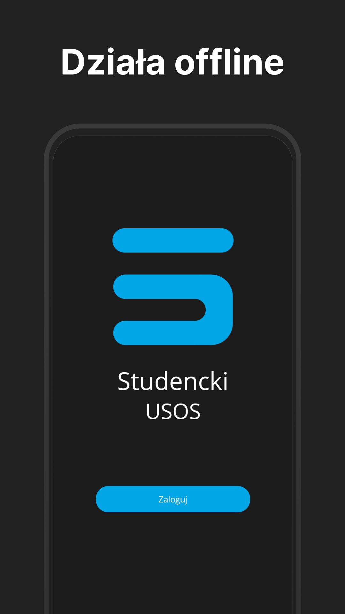
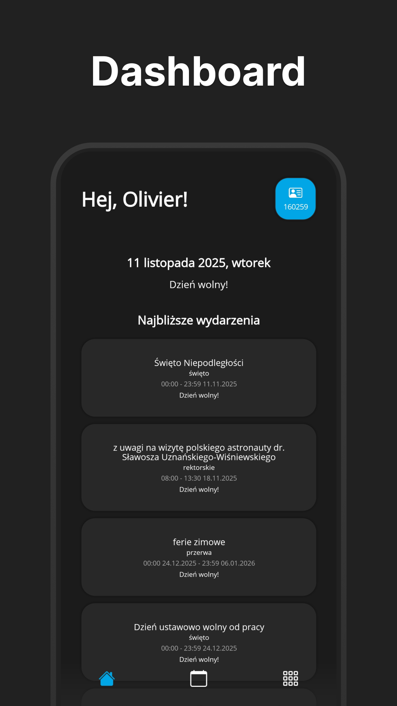
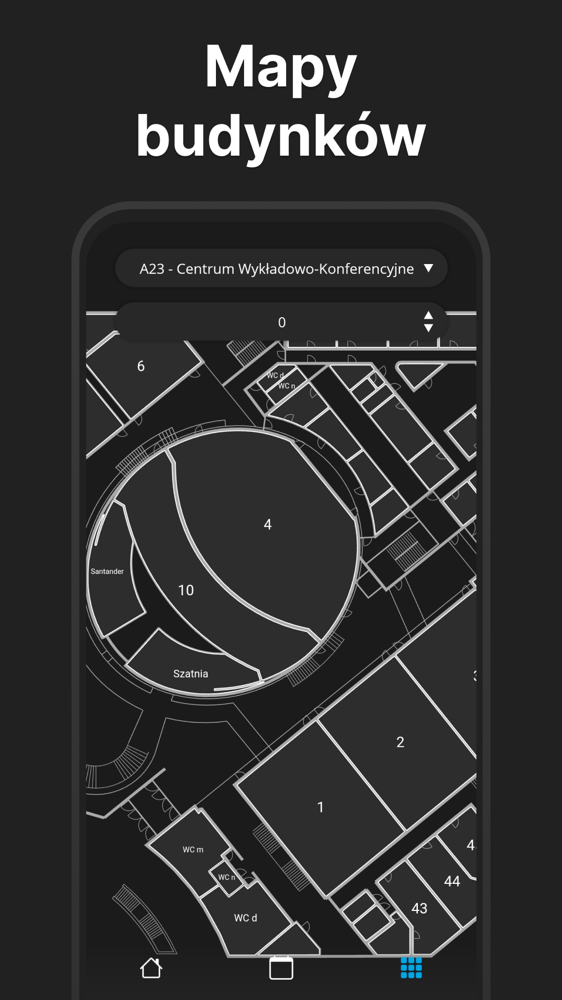
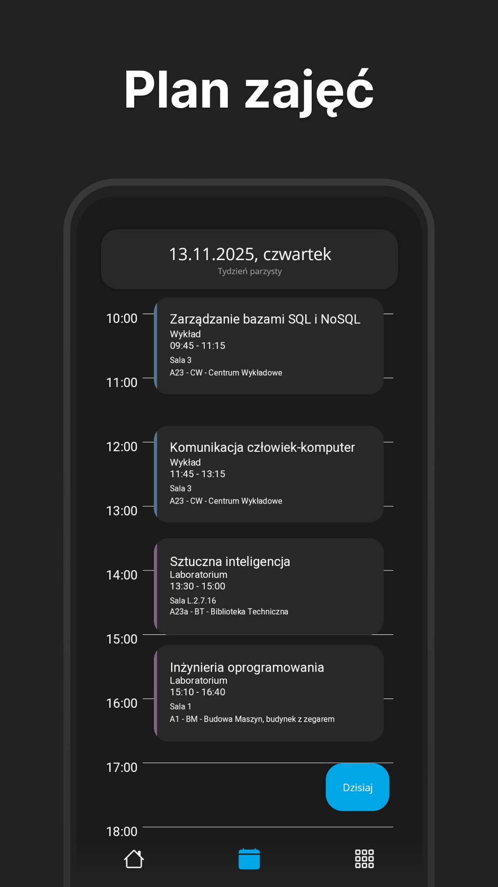
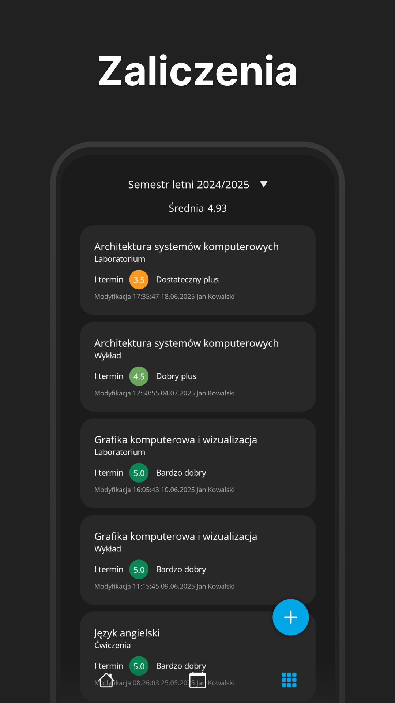
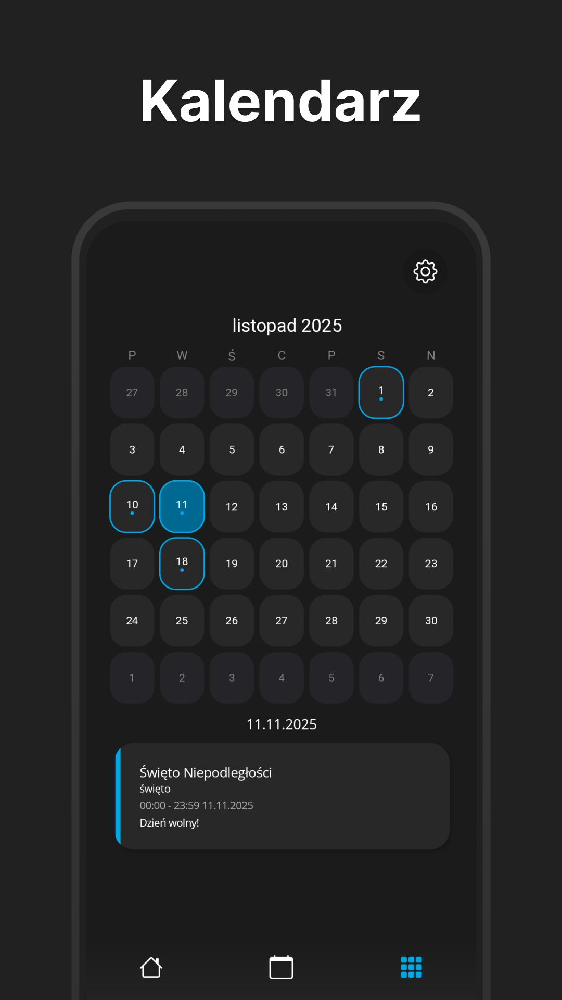

# Student USOS
Mobile app for polish students of Poznań University of Technology providing access to all the necessary modules of USOS (University Study Organization System). 

# Download
  You can get it on
  <a href="https://play.google.com/store/apps/details?id=com.ovrbtn.studencki_usos_put">
    Google Play Store
    
  </a>

or in [Releases tab](https://github.com/OvrBtn/StudentUsos/releases) (but then you won't get automatic updates).

# Screenshots

# Contributing
This repo currently doesn't allow contributions. Any pull requests will get automatically closed.

# FAQ
## Is there going to be a iOS version?
Currently it's not planned.

# Features

